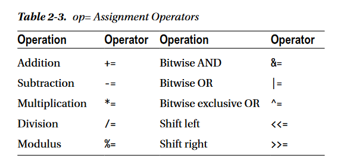
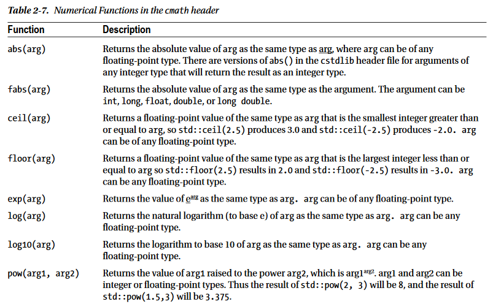
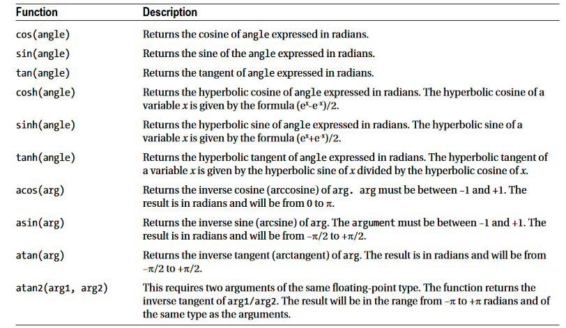

# Curso de C++ Básico

C++ es un lenguaje de programación, es uno de los más utilizados en todo el mundo. 
Para programar en C++, se necesita un compilador y un editor.
El **compilador** traduce el código fuente a código máquina (Código Binario), y el **editor** es el programa que nos colorea la sintaxis del lenguaje para poder escribir el código  cómodamente,

Hay algunos programas que son compiladores y editores, se conocen como IDE (Entorno de desarrollo Integrado). por ejemplo.
- Dev C++
- CodeBlocks
- [Zinja](http://zinjai.sourceforge.net/). Es un programa similar a PSeint en la interfaz.

Cualquiera que se escoja se debe descargar e instalar.

En el caso de usar **Dev C++**, al crear un nuevo proyecto debemos ir a *Menu -> Nuevo -> Proyecto* y allí escogemos el tipo de aplicación que queramos escoger.

Para ejecutar el programa, debemos previamente haberlo compilado. También podemos usar el botón de **compilar y ejecutar**


## Hola Mundo

Primero, debemos crear un nuevo proyecto, y luego crear un archivo llamado **main.cpp**
Luego de eso, debemos incluir las librerías, que son un conjunto de código que viene predefinido y que nos facilita el trabajo.

Para incluir una librería usamos la sentencia
```c++
#include <stdio.h>

int main(){
    printf("Hola Mundo \n");
    std::cout << "Hi everyone" << std::endl;
    return 0;
}
```
*stdio.h* **`.h`** porque es una cabecera.
*`\n`* Es un operador de escape, el compilador lo detecta como un salto de línea.

- **Librería** Conjunto de herramientas que viene con código predefinido, lo que nos permite facilitar el trabajo.


## Variables enteras (`int`)

**iostream** Es una librería que nos permite escribir y leer información por consola.
```cpp
#include <iostream>
```

Para declarar un variable en *C++¨*, debemos primero colocar el tipo de dato. Por ejemplo:
```cpp
int num = 31;
// Otra forma de delcarar y asignar valor es
int num{23};
```

Para evitar colocar prefijos a las funciones, es necesario especificar los espacios de nombre que vamos a utilizar, por ejemplo:
```cpp
using namespace std;

// Si no usaramos los espacios de nombre, nos tocaría usar 
std::cout << "Hola mundo \n Hola universo " << endl;
```

Si queremos que haya salto de línea, podemos usar el operador de escape `\n`, y así colocamos texto en una nueva línea.

## Variables `bool` y `char`

- **char** Esta tipo de dato almacena caracteres
- **bool** Este tipo de dato almacena valores booleanos (false o verdadero), `true` `false`

### Variable de tipo `char`

Si por ejemplo colocamos una palabra en una variable de tipo **char**, el compilador, sólo tomará el último caracter. En este caso usamos *comillas simples*
```cpp
char letra = 'Hola mundo';
```

Para mostrar varios caracteres usamos comillas dobles y colocamos un __`*`__, al final de la palabra reservada `char` .

### Variable de tipo `bool`
Es un tipo de variable lógico, 0 - 1, ó verdadero y falso.
0 == false
1 == true

Para declarar una variable booleana, indicamos el tipo de dato `bool`
```cpp
bool variable = true; // false | true
```


## Variable de tipo `float`

Son variables que guardar números de coma flotante de baja precisión, son como decimales que no tienen muchos decimales (No tiene tanto espacio en la memoria).

En algunos casos, el compilador redondea el número a un valor superior o inferior.

```cpp
float num = 5.23478;
```

## Variable de tipo `double`

Son tambien números de punto flotante que tienen más precisión ó espacio que memoria que los float. Funciona para números con más caracteres.
```cpp
double num = 12.3479835;
```

## Constantes

Son variables que no pueden ser modificadas durante la ejecución del programa. Lo valores que le asignemos no se pueden cambiar.

```cpp
// Es una constante, su valor no se puede cambiar
const int numero = 11;
```


## Operadores Aritméticos

Son los que nos permiten realizar operaciones matemáticas.

```cpp
int num1 = 2;
int num2 = 6;
int suma = num1 + num2;
```

- Suma `+`
- Resta `-`
- Multiplicación `*`
- División `/`
- Módulo (Residuo de la división) `%`


## Operadores de Asignación

El operador de asignación general es `=`. Exiten otros como:
- **Asigna una suma** `+=` Suma un valor a la variable 
- **Asigna una resta** `-=` Resta un valor a la variable
- **Asigna una multiplicación** `*=` Resta un valor a la variable

```cpp
// Declaración;
int operacion;
// Asignación
operacion = 12;
// Operador de asignación
operacion *= 3;
``` 

Algunos ejemplos de operadpres de asignación son:


## Operadores de Comparación

- *Operador de comparación* `==`
- *Distinto o diferente* `!=`
- *Mayor que* `>`
- *Mayor o igual que* `>=`
- *Menor que* `<`
- *Menor o igual que* `<=`

Estos operadores son usamos en los condicionales y ciclos, donde comparamos dos valores para realizar una determinada acción.

## Operadores lógicos

- *and* `&&`
	Si ambas condiciones se cumplen, retorna true
- *or* `||`
	Si alguna de las dos condiciones se cumple, retorna true.
- *Negación* `!`
	Niega una condición. Si es true, lo vuelve false y viciversa.

## Funciones matemáticas

La librería header Standard `cmath`define un rango de funciones trigonométricas y numéricas que puede usar en todos sus programas. A continuación se presenta una tabla con las funciones más útiles.



*Img. Referencia Beginning C++ Ivor Horton (Pag. 40)*
## Sentencias `if` (Condicionales)

Permiten comparar dos variables para ejecutar una acción determinada. La condición se cumple siempre y cuando la condición sea verdadera. 

```cpp
if (numero1 < numero2){
    cout << "Es menor" << endl;
} else if (numero1==numero2){
    cout<<"Son iguales"<< endl;
} else {
    cout << "Es mayor" << endl;
}
```

## Sentencia `switch`

Es un tipo de condicional que dado un valor introducido los compara con los casos que tiene definido. Un ejemplo de switch en `C++` es el siguiente

```cpp
switch (c){
    case 'a':
    case 'e':
    case 'i':
    case 'o':
    case 'u':	
        cout << "El una vocal." << endl;
        break;
default:
    cout << "Es una consonante" << endl;
    break;
}
```

## Comentarios

Son útiles para ordenar el código y explicar el código. Cuando se compila el programa, el compilador ignora estas líneas y nos las lee.

```cpp 
/**
* Comentario multilínea
*/

// Comentario de una sola línea
```